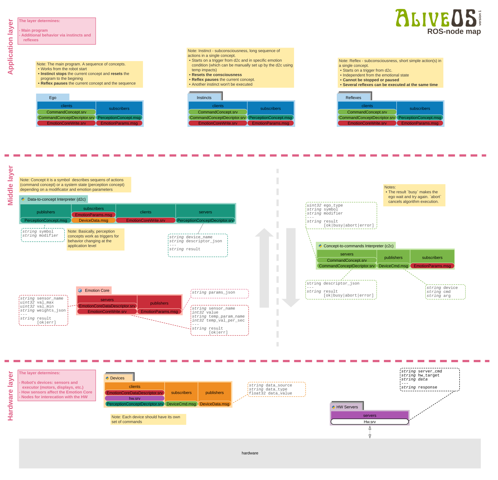

# Alive OS

OS implementing the behavior of a living being in electronics.

## Description

AliveOS is an operating system using ROS infrastructure and woking withing it. The OS implements structures of animal brains such as: reflexes, instincts, hormones, etc.

This is a metapackage for ROS Noetic

## Dependencies

- Python 3
- ROS Noetic

## Installation

- Create a catkin workspace
- In the `src` directory of the workspace clone the repository `git clone https://github.com/an-dr/aliveos.git`
- To download other packages use the `download.sh` script

## Structure

